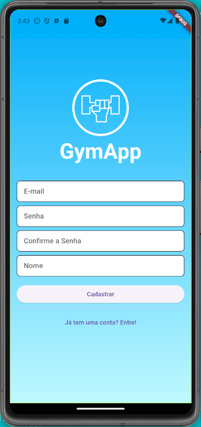
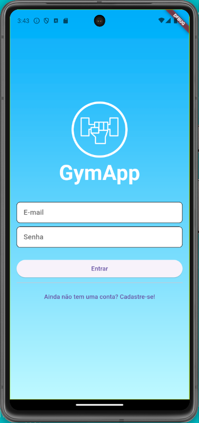
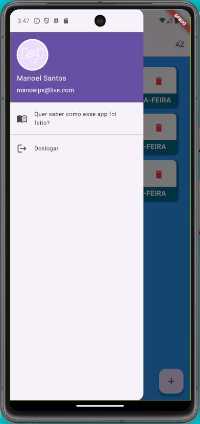
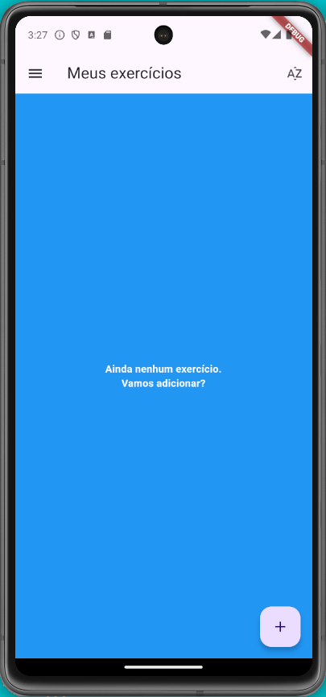
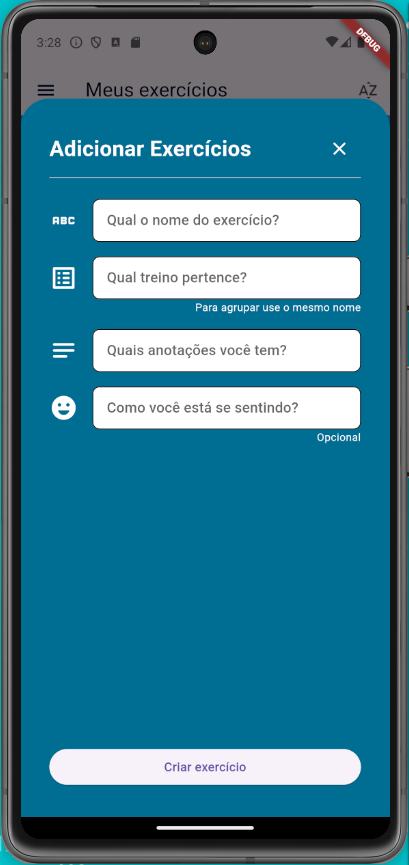
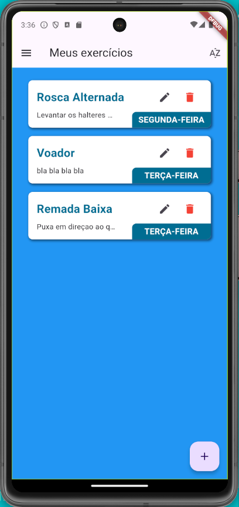
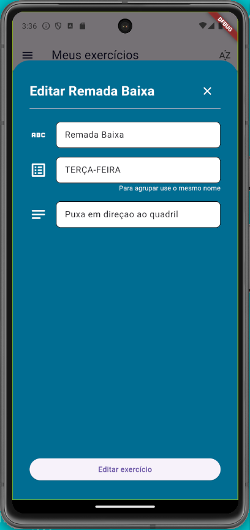
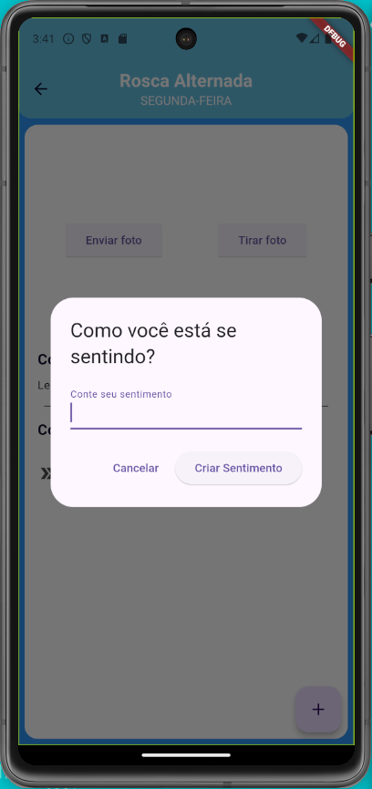
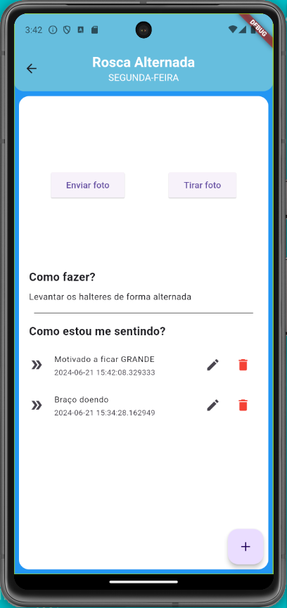
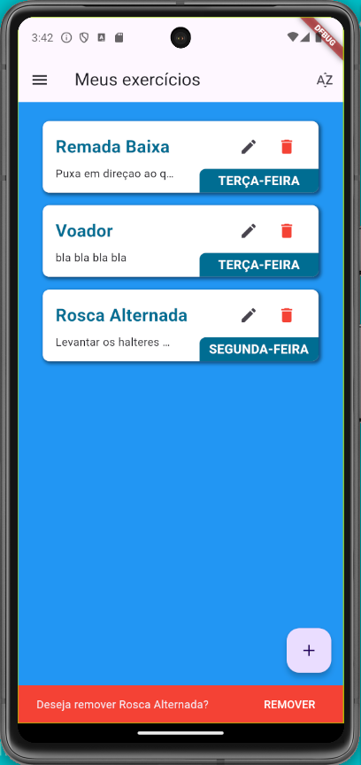

# flutter_gymapp

Projeto em flutter para criar um Aplicativo do tipo Diario de Academia

## Começando

Este projeto é um ponto de partida para uma aplicação Flutter.

Alguns recursos que você já deve ter antes de iniciar a aplicação:

-   Tenha uma conta no [Firebase](https://console.firebase.google.com/?hl=pt-br) e crie um novo projeto
-   Configurando a conexão com o projeto no firebase: Pelo terminal, entre no diretório do projeto e execute o comando `flutterfire configure`, siga o que é solicitado para configurar o acesso ao firebase.

#

